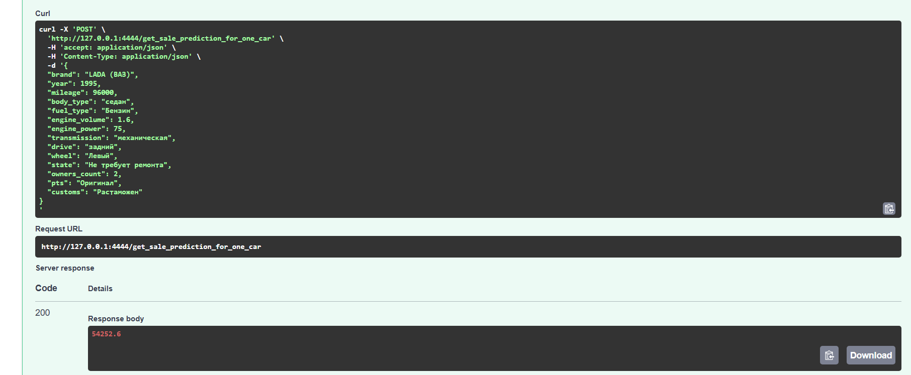
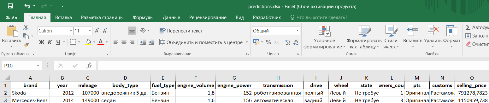
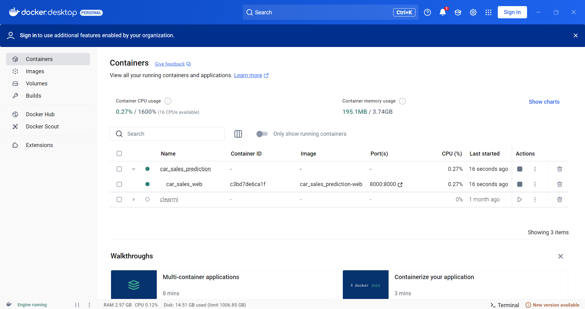
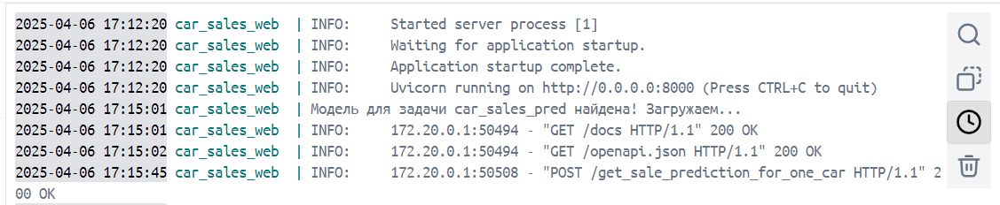

## Проект "Сервис машинного обучения для прогноза стоимости автомобиля"

Цель проекта: создать интеллектуальную систему прогнозирования стоимости автомобилей, работающую в реальном времени с применением технологий машинного обучения. 

Данная система поможет частным лицам, автодилерам и страховым компаниям оценивать рыночную стоимость автомобилей без необходимости ручной разработки математических и экономических моделей.

Для достижения цели, выполнены следующие задачи:

Подготовка данных:

1. Из открытых источников взят датасет auto.ru с выборкой в 333 тысячи объектов.

2. Произведен EDA-анализ датасета (оценено распределение данных, данные проверены на дубликаты и пропуски, данные проверены на их применимость к подаче в модель).

3. Выполнен импорт данных в БД PostgreSQL.

4. Разработан алгоритм работы с датасетами, которые не влезают в память устройства.

5. Сформирован пайплайн обучения модели с использованием алгоритма из пункта 3.

Веб-сервис на FastAPI:

1. Реализован пайплайн обработки данных и обучения моделей через специализированные функции и модули.

2. Описана структура данных через pydantic (один объект, несколько объектов).

3. Реализованы эндпоинты для прогнозов (один объект, несколько объектов). Для одного объекта - отправляется JSON с признаками одного автомобиля, на выходе возвращается прогнозная стоимость. Для нескольких - загружается XLSX-файл с признаками автомобилей, на выходе возвращается обновленный файл с добавленным столбцом прогнозных значений для каждого объекта.

Сборка сервиса:

1. Выполнено развертывание разработанного сервиса посредством технологии Docker.

Результаты:

**Средняя ошибка прогнозов достигает 20%.**

Прогноз для одного объекта:

Прогноз для нескольких объектов:

Запущенный Docker-контейнер:

Консоль Docker-контейнера:

Планы по дальнейшему развитию проекта:

1. Расширение функционала используемых моделей и добавление новых тасков.

2. Формирование подсистемы логирования экспериментов обучения моделей (метрики, графики и т.д) (посредством ClearML).

3. Реализация режима параллельного обучения моделей посредством функционала Dask.